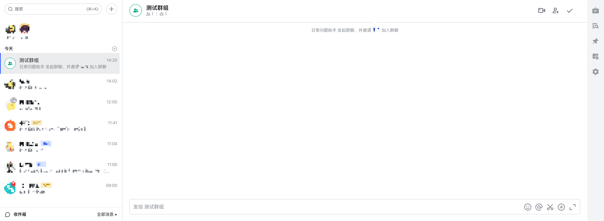
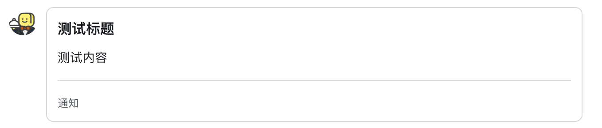
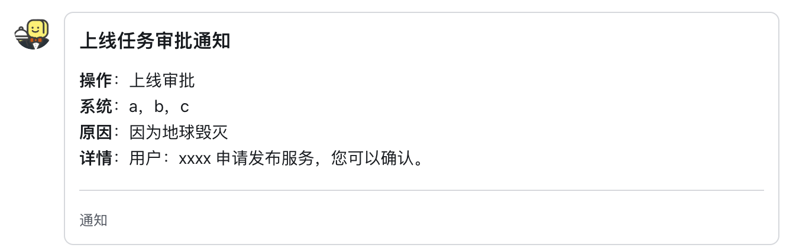
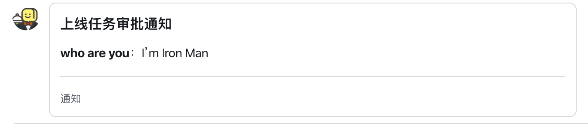
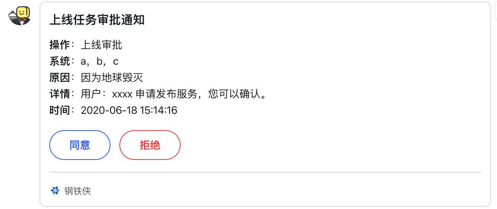

## 飞书 sdk

第三方Feishu库，目前只实现了使用的`机器人`部分功能，后续会看精力继续完善

### 导入
``` python
from feishu.Application import Bot

bot = Bot(app_id='xxxxxxxxxxxxxxx', app_secret="xxxxxxxxxxxxxxx")
```

### 事前准备

测试的话需要给自己发送消息，我们需要一个飞书的[登录预授权码](https://open.feishu.cn/document/ukTMukTMukTM/ukzN4UjL5cDO14SO3gTN)

注意失效，仅为5分钟

你需要在[飞书开放平台](https://open.feishu.cn/) 所测试的机器人 -> 安全设置中 添加一个重定向URL,内容为`https://example.com`

然后下面方法或手动拼接，获取一个地址，类似于`https://open.feishu.cn/open-apis/authen/v1/index?app_id=xxxxxxxxx&redirect_uri=https://example.com&state= `，在浏览器中打开，登录后,从地址栏中拿到预授权码
``` python
print(bot.get_authorization_code_by_browser_url())
```

然后获取你自己的 open_id
``` python
print(bot.get_user_info(code='上面获取的预授权码'))
```

### 部分功能实例

#### 获取Token
``` python
# 租户Token
print(bot.get_tenant_access_token())
# app Token
print(bot.get_app_access_token())

#返回示例 (请注意，token的expire字段是在官方返回失效时间基础上计算出的具体的失效时间戳)
##tenant_access_token
{'code': 0, 'expire': 1592468406.488201, 'msg': 'ok', 'tenant_access_token': 't-be56a33ef75ce4bb867ccc84ac0da5fdf8017c2b'}
##app_access_token
{'app_access_token': 't-be56a33ef75ce4bb867ccc84ac0da5fdf8017c2b', 'code': 0, 'expire': 1592468406.551423, 'msg': 'ok', 'tenant_access_token': 't-be56a33ef75ce4bb867ccc84ac0da5fdf8017c2b'}
```

#### 创建群组
``` python
bot.create_group(name="测试群组", open_ids=['xxxxxxx'])
```

``` python
#返回示例
{'code': 0, 'data': {'chat_id': 'oc_4ebe54802633fa661305f06ec7a99cb0', 'invalid_open_ids': [], 'invalid_user_ids': []}, 'msg': 'ok'}
```

#### 发送文字消息
``` python
bot.send_user_message(user_open_id="ou_b7fd6a20da4e3903bc2324b71232c5ac", text='Hi,feishu~')
```

``` python
#返回示例
{'code': 0, 'data': {'message_id': 'om_74cde4875127f7e39a47153d59d508be'}, 'msg': 'ok'}
```

#### 发送卡片消息(默认样式)
``` python
bot.send_user_card_message(user_open_id="ou_b7fd6a20da4e3903bc2324b71232c5ac", title="测试标题", text="测试内容")
```

#### 发送通知卡片消息（基于飞书markdown）
此功能初衷是为了实现消息通知更美观一些，故样式针对样式做了一点调整。

请注意，飞书卡片消息并非支持所有Markdown语法，请参考[文档](https://open.feishu.cn/document/ukTMukTMukTM/uADOwUjLwgDM14CM4ATN) 
``` python
message_config = {
            'title': '上线任务审批通知',
            'action': '上线审批',
            'system': '，'.join(['a', 'b', 'c']),
            'reason': '因为地球毁灭',
            'detail': '用户：xxxx 申请发布服务，您可以确认。',
        }
bot.send_user_card_message(user_open_id="ou_b7fd6a20da4e3903bc2324b71232c5ac", **message_config)
```


``` python
#返回数据格式
{'code': 0, 'data': {'message_id': 'om_b3747313d4f46a9e61067461cc24955a'}, 'msg': 'ok'}
```
你可能会好奇为什么你传入的是`action`,但在通知时会转换成中文`操作`，因为为了使用方便已经将一些常用的业务场景关键参数做了映射，你可以做如下操作自定义
``` python
from feishu.Application import Bot
Bot.MESSAGE_MAP={
    'your key':'your value'
}
```
当没有匹配到关键词时，将会使用你的参数名做默认显示。
例如
``` python
message_config = {
    'title': '上线任务审批通知',
    'who are you': "I'm Iron Man",
}
bot.send_user_card_message(user_open_id="ou_b7fd6a20da4e3903bc2324b71232c5ac", **message_config)
```


#### 消息卡片增加按钮(button)
这里对消息卡片的button模块做了简单的封装，你可以从官方文档获得更详细的[资料](https://open.feishu.cn/document/ukTMukTMukTM/uEzNwUjLxcDM14SM3ATN)

你只需要传入`button`字段即可，列表内可写多个button。你需要在button中的`value`字段写入自己业务需要的信息。更多交互详情请参考上面官方文档链接。
``` python
message_config = {
            'title': '上线任务审批通知',
            'action': '上线审批',
            'system': '，'.join(['a', 'b', 'c']),
            'reason': '因为地球毁灭',
            'detail': '用户：xxxx 申请发布服务，您可以确认。',
            'button': [
                {
                    'title': '同意',
                    'type': 'primary',
                    'value': {
                        'action': 'approval_online_order',
                        'order_id': '12345',
                        'option': 'agree'
                    },
                },
                {
                    'title': '拒绝',
                    'type': 'danger',
                    'value': {
                        'action': 'approval_online_order',
                        'order_id': '12345',
                        'user_id': '123',
                        'option': 'disagree'
                    }
                },
            ]
        }
bot.send_user_card_message(user_open_id="ou_b7fd6a20da4e3903bc2324b71232c5ac", **message_config)
```


``` python
#返回数据格式
{'code': 0, 'data': {'message_id': 'om_b3747313d4f46a9e61067461cc24955a'}, 'msg': 'ok'}
```
#### 卡片消息格式自定义
这里支持对卡片消息做更详细的调整

|参数名|值|说明|
|----|----|----|
|image_key|飞书图片的image_key|可增加卡片消息图标，增加正式感。image_key获取方法参考[文档](https://open.feishu.cn/document/ukTMukTMukTM/uEDO04SM4QjLxgDN)|
|button_confirm|True/False|button是否需要二次确认|
|name|str|卡片通知者名称，默认为：**通知**|
|auto_add_time|True/False|自动增加通知时间，为True时,会在内容自动增加一行|


``` python
bot.configuration_card_message(image_key="img_5abe5193-14df-4b7d-af6f-15fac38c485g", 
                               button_confirm=False, 
                               name='钢铁侠',
                               auto_add_time=True)

bot.send_user_card_message(user_open_id="ou_b7fd6a20da4e3903bc2324b71232c5ac", **message_config)
```


``` python
#返回数据格式
{'code': 0, 'data': {'message_id': 'om_b3747313d4f46a9e61067461cc24955a'}, 'msg': 'ok'}
```
